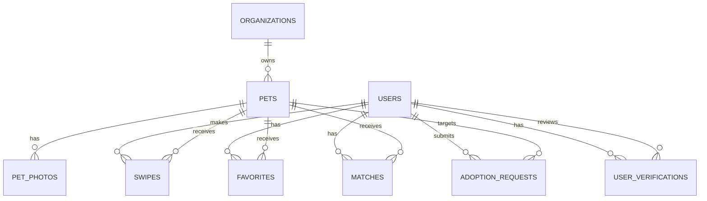

# PetMatch - Etapa 1

Documento inicial da arquitetura, do domínio e do modelo de dados. A ideia aqui é definir a base do MVP sem implementar ainda a aplicação.

## 1. Visão geral

O PetMatch será uma aplicação web monolítica modular, com separação clara entre:

- `Domain`: regras de negócio puras;
- `Application`: casos de uso e orquestração;
- `Infrastructure`: PDO, persistência, storage e integrações;
- `Presentation`: controllers, requests e responses.

A primeira versão prioriza simplicidade, testabilidade e evolução incremental.

## 2. Bounded contexts / domínios

### Identity & Access
Responsável por cadastro, autenticação, sessão, papéis e verificações de confiança.

### Organization Management
Responsável por cadastro e administração de organizações autorizadas.

### Pet Catalog
Responsável por pets, fotos, status de disponibilidade e informações públicas.

### Discovery
Responsável por feed, filtro e recomendação inicial de pets.

### Engagement
Responsável por swipes, favoritos e matches do MVP.

### Adoption
Responsável por solicitações de adoção, transições de status e aprovação/rejeição.

## 3. Entidades do domínio

### User
Representa a pessoa que acessa a plataforma.

Atributos centrais:
- id
- name
- email
- passwordHash
- role
- status
- createdAt
- updatedAt

### UserVerification
Representa cada verificação de confiança do usuário.

Tipos previstos:
- email
- whatsapp
- identity_document

Status previstos:
- pending
- verified
- rejected
- expired

### Organization
Representa uma ONG ou entidade responsável por pets.

### Pet
Representa o animal disponível para adoção ou já adotado.

### PetPhoto
Representa imagens associadas ao pet.

### Swipe
Representa a decisão do usuário sobre um pet.

### Favorite
Representa uma intenção persistente do usuário.

### Match
No MVP, representa um pet curtido que ainda está disponível.

### AdoptionRequest
Representa uma solicitação formal de adoção.

## 4. Value Objects

Os value objects devem ser usados apenas onde trazem benefício real.

Recomendados nesta etapa:

- EmailAddress
- PhoneNumber
- PasswordHash
- PetId
- OrganizationId
- UserId
- Money: não necessário no MVP
- GeoPoint para latitude/longitude, se isso realmente for usado em recomendação

## 5. Enums

Enums úteis para o MVP:

- UserRole: adopter, organization_admin, admin
- UserStatus: active, pending, suspended, deleted
- VerificationType: email, whatsapp, identity_document
- VerificationStatus: pending, verified, rejected, expired
- PetStatus: available, reserved, adopted, archived, inactive
- PetGender: male, female, unknown
- PetSize: small, medium, large, extra_large
- SwipeAction: like, pass
- AdoptionRequestStatus: pending, approved, rejected, withdrawn
- MatchStatus: active, archived

## 6. Casos de uso

### Identity & Access
- RegisterUser
- AuthenticateUser
- VerifyEmail
- VerifyWhatsapp
- SubmitIdentityDocument
- ReviewIdentityDocument

### Organization
- CreateOrganization
- UpdateOrganization
- ApproveOrganization
- SuspendOrganization

### Pet Catalog
- CreatePet
- UpdatePet
- ArchivePet
- GetPet
- ListPets
- AddPetPhoto
- RemovePetPhoto

### Engagement
- SwipePet
- CreateFavorite
- RemoveFavorite
- ListFavorites
- ListMatches

### Adoption
- CreateAdoptionRequest
- ListAdoptionRequests
- ApproveAdoptionRequest
- RejectAdoptionRequest
- WithdrawAdoptionRequest
- MarkPetAsAdopted

## 7. Regras de negócio iniciais

- Um usuário pode se cadastrar sem estar totalmente verificado.
- E-mail, WhatsApp e documento são verificações independentes.
- A ação de adoção exige o nível mínimo de verificação definido pela regra do MVP.
- Somente organizações autorizadas podem gerenciar seus pets.
- Um pet adotado ou arquivado não aceita novas interações.
- Um usuário não pode registrar dois swipes ativos para o mesmo pet.
- Favorito deve ser idempotente.
- A solicitação de adoção deve possuir estados válidos e transições permitidas.
- Histórico de swipes e solicitações não deve ser apagado para simular auditoria mínima.
- Alterações sensíveis devem ocorrer com transação quando houver múltiplos passos.

## 8. Relacionamentos

- User 1:N UserVerification
- Organization 1:N Pet
- Pet 1:N PetPhoto
- User 1:N Swipe
- Pet 1:N Swipe
- User 1:N Favorite
- Pet 1:N Favorite
- User 1:N Match
- Pet 1:N Match
- User 1:N AdoptionRequest
- Pet 1:N AdoptionRequest
- Organization 1:N AdoptionRequest indireto via pet

## 9. Modelo inicial do banco

### users
- id
- name
- email
- password_hash
- role
- status
- created_at
- updated_at

### user_verifications
- id
- user_id
- type
- status
- value_hash
- provider_reference
- verified_at
- reviewed_by
- rejection_reason
- created_at
- updated_at

### organizations
- id
- name
- description
- email
- phone
- status
- created_at
- updated_at

### pets
- id
- organization_id
- name
- description
- animal_type
- breed
- gender
- birth_date
- size
- status
- city
- state
- latitude
- longitude
- created_at
- updated_at

### pet_photos
- id
- pet_id
- path
- sort_order
- created_at

### swipes
- id
- user_id
- pet_id
- action
- created_at

### favorites
- id
- user_id
- pet_id
- created_at

### matches
- id
- user_id
- pet_id
- created_at

### adoption_requests
- id
- user_id
- pet_id
- status
- message
- created_at
- updated_at

## 10. Decisões de modelagem

### Por que `user_verifications` separado
Porque e-mail, WhatsApp e documento têm ciclos diferentes, auditoria diferente e status diferentes. Um único booleano não representa o estado real do usuário.

### Por que `status` em `users`
Porque o usuário pode existir sem estar ativo para uso completo da plataforma. Isso permite suspender, arquivar ou bloquear contas sem apagar histórico.

### Por que `matches` existe no MVP
Porque o conceito de match aqui é funcional, não recíproco. Ele serve para destacar pets já curtidos que ainda estão disponíveis.

### Por que não criar mais entidades agora
Porque o MVP precisa de foco. Documentos extras, notificações, chat, pagamentos e IA ficam para fases posteriores.

## 11. Banco e integridade

Regras que devem virar constraint sempre que possível:

- unicidade de `users.email`
- unicidade de `favorites.user_id + favorites.pet_id`
- unicidade de `matches.user_id + matches.pet_id`
- unicidade de `swipes.user_id + swipes.pet_id`
- unicidade de `adoption_requests.user_id + adoption_requests.pet_id` para solicitações ativas
- `CHECK` para status e enums simulados no banco quando o dialeto e a migration suportarem
- foreign keys explícitas com `ON DELETE` definido por caso

## 12. Diagrama ER



## 13. Estrutura inicial de diretórios

```text
petmatch/
├── public/
│   └── index.php
├── src/
│   ├── Domain/
│   │   ├── User/
│   │   ├── Organization/
│   │   ├── Pet/
│   │   ├── Swipe/
│   │   ├── Match/
│   │   └── Adoption/
│   ├── Application/
│   │   ├── Identity/
│   │   ├── Organization/
│   │   ├── Pet/
│   │   ├── Engagement/
│   │   └── Adoption/
│   ├── Infrastructure/
│   │   ├── Database/
│   │   ├── Persistence/
│   │   ├── Storage/
│   │   └── Http/
│   └── Presentation/
│       ├── Controllers/
│       ├── Requests/
│       └── Responses/
├── database/
│   ├── migrations/
│   └── seeders/
├── tests/
│   ├── Unit/
│   ├── Integration/
│   └── Feature/
├── config/
├── routes/
├── storage/
├── docker/
├── composer.json
├── docker-compose.yml
├── phpunit.xml
├── phpstan.neon
└── README.md
```

## 14. Próximo passo sugerido

Depois de validar esta proposta, a próxima entrega deve ser o esqueleto real do projeto:

- composer.json
- autoload PSR-4
- diretórios base
- config inicial
- primeira migration do banco
- conexão PDO centralizada
